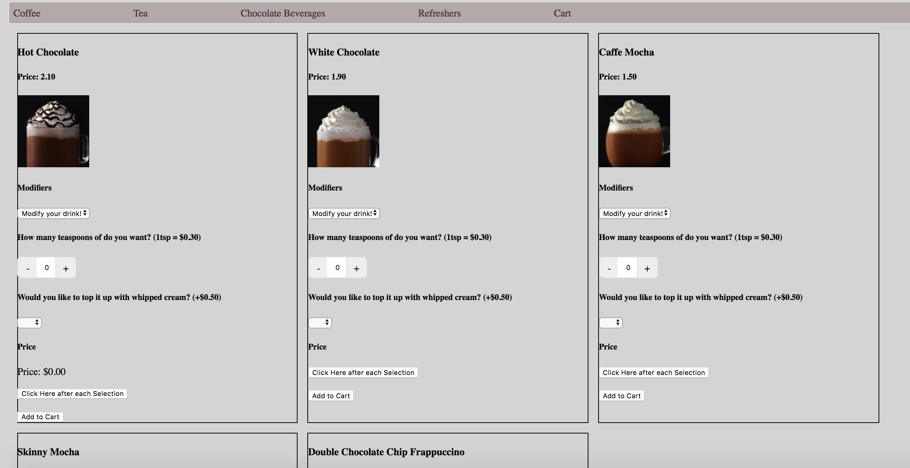
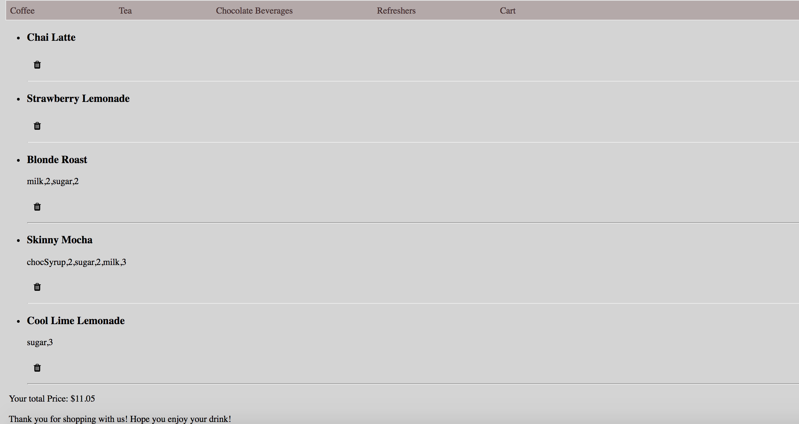

# KdShoppingcart

This project was generated with [Angular CLI](https://github.com/angular/angular-cli) version 6.1.0.

## Installation Instructions

Install packages and run the project ([Node.js](https://nodejs.org/en/) and [Angular CLI](https://github.com/angular/angular-cli) are required).
```shell
npm install
ng serve
```

## Development server

Run `ng serve` for a dev server. Navigate to `http://localhost:4200/`. The app will automatically reload if you change any of the source files.

### Sample Images of the project



